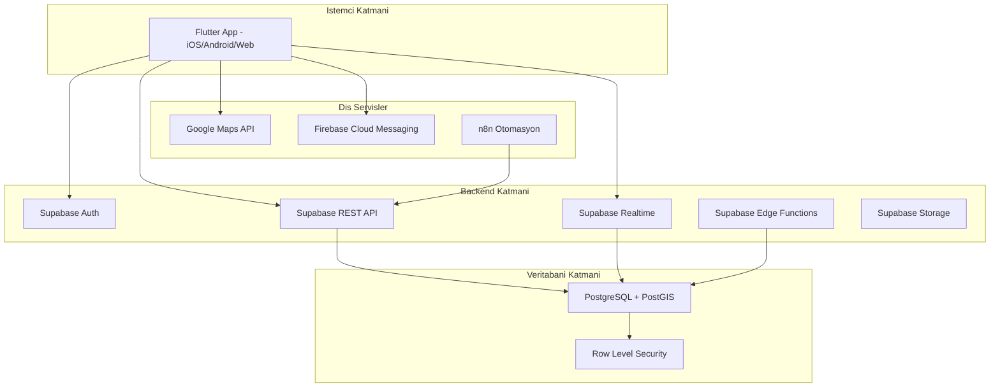
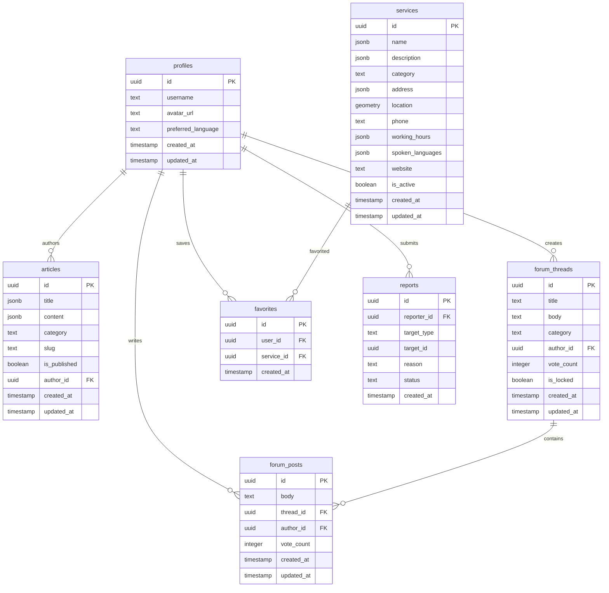
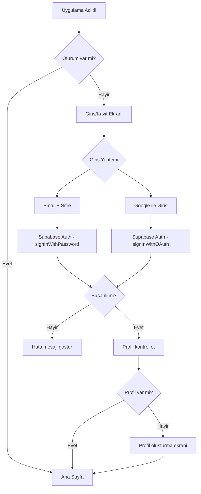
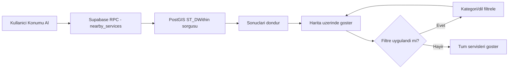
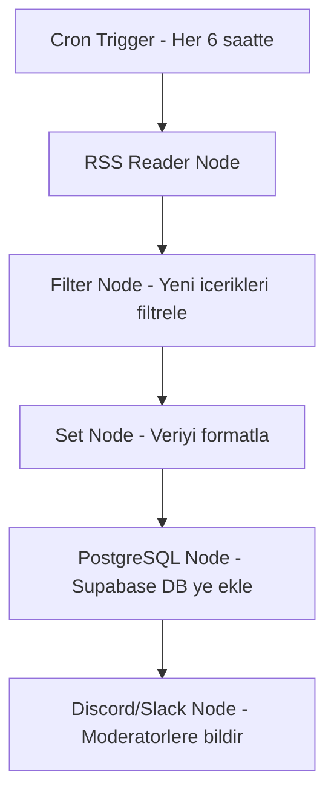

# YeniYuva - Proje Mimari Planı ve Yol Haritası

## 1. Sistem Mimarisi Genel Bakış



## 2. Flutter Proje Klasör Yapısı - Clean Architecture

```
yeni_yuva/
├── lib/
│   ├── main.dart
│   ├── app.dart
│   ├── core/
│   │   ├── constants/
│   │   │   ├── app_colors.dart
│   │   │   ├── app_strings.dart
│   │   │   └── api_constants.dart
│   │   ├── errors/
│   │   │   ├── failures.dart
│   │   │   └── exceptions.dart
│   │   ├── network/
│   │   │   └── network_info.dart
│   │   ├── theme/
│   │   │   ├── app_theme.dart
│   │   │   └── text_styles.dart
│   │   ├── utils/
│   │   │   ├── location_helper.dart
│   │   │   └── date_formatter.dart
│   │   └── widgets/
│   │       ├── loading_widget.dart
│   │       ├── error_widget.dart
│   │       └── custom_app_bar.dart
│   │
│   ├── features/
│   │   ├── auth/
│   │   │   ├── data/
│   │   │   │   ├── datasources/
│   │   │   │   │   └── auth_remote_datasource.dart
│   │   │   │   ├── models/
│   │   │   │   │   └── user_model.dart
│   │   │   │   └── repositories/
│   │   │   │       └── auth_repository_impl.dart
│   │   │   ├── domain/
│   │   │   │   ├── entities/
│   │   │   │   │   └── user_entity.dart
│   │   │   │   ├── repositories/
│   │   │   │   │   └── auth_repository.dart
│   │   │   │   └── usecases/
│   │   │   │       ├── sign_in.dart
│   │   │   │       ├── sign_up.dart
│   │   │   │       └── sign_out.dart
│   │   │   └── presentation/
│   │   │       ├── providers/
│   │   │       │   └── auth_provider.dart
│   │   │       ├── pages/
│   │   │       │   ├── login_page.dart
│   │   │       │   └── register_page.dart
│   │   │       └── widgets/
│   │   │           └── auth_form.dart
│   │   │
│   │   ├── service_map/
│   │   │   ├── data/
│   │   │   │   ├── datasources/
│   │   │   │   │   ├── service_remote_datasource.dart
│   │   │   │   │   └── service_local_datasource.dart
│   │   │   │   ├── models/
│   │   │   │   │   └── service_model.dart
│   │   │   │   └── repositories/
│   │   │   │       └── service_repository_impl.dart
│   │   │   ├── domain/
│   │   │   │   ├── entities/
│   │   │   │   │   └── service_entity.dart
│   │   │   │   ├── repositories/
│   │   │   │   │   └── service_repository.dart
│   │   │   │   └── usecases/
│   │   │   │       ├── get_nearby_services.dart
│   │   │   │       ├── filter_services.dart
│   │   │   │       └── search_services.dart
│   │   │   └── presentation/
│   │   │       ├── providers/
│   │   │       │   └── service_map_provider.dart
│   │   │       ├── pages/
│   │   │       │   ├── map_page.dart
│   │   │       │   └── service_detail_page.dart
│   │   │       └── widgets/
│   │   │           ├── service_card.dart
│   │   │           ├── category_filter.dart
│   │   │           └── map_marker.dart
│   │   │
│   │   ├── info_center/
│   │   │   ├── data/
│   │   │   ├── domain/
│   │   │   └── presentation/
│   │   │
│   │   ├── forum/
│   │   │   ├── data/
│   │   │   ├── domain/
│   │   │   └── presentation/
│   │   │
│   │   └── profile/
│   │       ├── data/
│   │       ├── domain/
│   │       └── presentation/
│   │
│   ├── l10n/
│   │   ├── app_tr.arb
│   │   ├── app_ar.arb
│   │   ├── app_en.arb
│   │   ├── app_fa.arb
│   │   ├── app_uk.arb
│   │   └── app_ru.arb
│   │
│   └── router/
│       └── app_router.dart
│
├── test/
├── pubspec.yaml
├── analysis_options.yaml
└── README.md
```

## 3. Veritabanı Şeması (PostgreSQL + PostGIS)



> **Not:** `name`, `description`, `title`, `content`, `address` gibi alanlar `jsonb` tipinde olacak. Bu sayede çoklu dil desteği doğrudan veritabanında sağlanacak:
> ```json
> {
>   "tr": "Sağlık Ocağı",
>   "ar": "مركز صحي",
>   "en": "Health Center"
> }
> ```

## 4. Temel Flutter Paketleri (pubspec.yaml)

| Paket | Kullanım Amacı |
|-------|---------------|
| `flutter_riverpod` | State Management |
| `go_router` | Navigasyon ve Deep Linking |
| `supabase_flutter` | Supabase SDK |
| `google_maps_flutter` | Harita entegrasyonu |
| `geolocator` | Konum servisleri |
| `drift` + `sqlite3_flutter_libs` | Yerel veritabanı (çevrimdışı mod) |
| `flutter_localizations` + `intl` | Çoklu dil desteği |
| `cached_network_image` | Görsel önbellekleme |
| `connectivity_plus` | İnternet bağlantı kontrolü |
| `firebase_messaging` | Push bildirimleri |
| `freezed` + `json_serializable` | Model sınıfları |
| `dartz` | Fonksiyonel programlama (Either tipi) |
| `flutter_svg` | SVG ikonlar |
| `shimmer` | Yükleme animasyonları |

## 5. Kimlik Doğrulama Akışı



## 6. Hizmet Haritası Veri Akışı



## 7. Faz Detayları ve Öncelikler

### FAZ 1 - MVP (3-4 Ay)
**Hedef:** Temel işlevselliğe sahip, kullanılabilir ürün.

1. **Ortam Kurulumu** (1 hafta)
   - Flutter SDK kurulumu
   - Supabase projesi oluşturma
   - Google Maps API key alma
   - CI/CD pipeline hazırlığı

2. **Proje İskeleti** (1 hafta)
   - Clean Architecture klasör yapısı
   - Riverpod kurulumu
   - go_router navigasyon yapısı
   - Tema ve temel widget'lar

3. **Çoklu Dil Altyapısı** (1 hafta)
   - intl ve ARB dosyaları (TR, AR, EN)
   - RTL desteği
   - Dil değiştirme mekanizması

4. **Veritabanı ve Auth** (2 hafta)
   - PostgreSQL şema oluşturma
   - PostGIS aktivasyonu
   - RLS politikaları
   - Auth modülü (email/şifre, Google)

5. **Hizmet Haritası** (3 hafta)
   - Google Maps entegrasyonu
   - Kategori filtreleme
   - Konum bazlı arama (PostGIS)
   - Hizmet detay sayfası
   - Rota oluşturma

6. **Bilgi Merkezi** (2 hafta)
   - Makale listeleme ve detay
   - Kategori bazlı görüntüleme
   - Arama fonksiyonu

7. **Admin Paneli** (2 hafta)
   - Basit web arayüzü
   - Hizmet CRUD işlemleri
   - Makale CRUD işlemleri

8. **Test ve Dağıtım** (1 hafta)
   - Unit ve widget testleri
   - Play Store / App Store hazırlığı

### FAZ 2 - Topluluk ve Çevrimdışı (2-3 Ay)
- Topluluk Forumu (Supabase Realtime)
- Kullanıcı profilleri
- Favori hizmetler
- Çevrimdışı mod (drift)
- Push bildirimleri (FCM)

### FAZ 3 - Otomasyon ve Ölçeklendirme (2-3 Ay)
- n8n RSS otomasyon
- Ek diller (FA, UK, RU)
- Gelişmiş moderasyon
- Analitik (Sentry, Firebase Analytics)

## 8. Supabase SQL Şema Taslağı

```sql
-- PostGIS eklentisini aktifleştir
CREATE EXTENSION IF NOT EXISTS postgis;

-- Profiller tablosu
CREATE TABLE profiles (
    id UUID REFERENCES auth.users(id) PRIMARY KEY,
    username TEXT UNIQUE,
    avatar_url TEXT,
    preferred_language TEXT DEFAULT 'tr',
    created_at TIMESTAMPTZ DEFAULT NOW(),
    updated_at TIMESTAMPTZ DEFAULT NOW()
);

-- Hizmet noktaları tablosu
CREATE TABLE services (
    id UUID DEFAULT gen_random_uuid() PRIMARY KEY,
    name JSONB NOT NULL,          -- {"tr": "...", "ar": "...", "en": "..."}
    description JSONB,
    category TEXT NOT NULL,        -- health, education, legal, housing, social_aid, employment, community
    address JSONB NOT NULL,
    location GEOMETRY(Point, 4326) NOT NULL,
    phone TEXT,
    working_hours JSONB,
    spoken_languages TEXT[],
    website TEXT,
    is_active BOOLEAN DEFAULT true,
    created_at TIMESTAMPTZ DEFAULT NOW(),
    updated_at TIMESTAMPTZ DEFAULT NOW()
);

-- Konum bazlı arama için spatial index
CREATE INDEX idx_services_location ON services USING GIST(location);

-- Rehber makaleleri tablosu
CREATE TABLE articles (
    id UUID DEFAULT gen_random_uuid() PRIMARY KEY,
    title JSONB NOT NULL,
    content JSONB NOT NULL,
    category TEXT NOT NULL,
    slug TEXT UNIQUE NOT NULL,
    is_published BOOLEAN DEFAULT false,
    author_id UUID REFERENCES profiles(id),
    created_at TIMESTAMPTZ DEFAULT NOW(),
    updated_at TIMESTAMPTZ DEFAULT NOW()
);

-- Forum başlıkları
CREATE TABLE forum_threads (
    id UUID DEFAULT gen_random_uuid() PRIMARY KEY,
    title TEXT NOT NULL,
    body TEXT NOT NULL,
    category TEXT,
    author_id UUID REFERENCES profiles(id) NOT NULL,
    vote_count INTEGER DEFAULT 0,
    is_locked BOOLEAN DEFAULT false,
    created_at TIMESTAMPTZ DEFAULT NOW(),
    updated_at TIMESTAMPTZ DEFAULT NOW()
);

-- Forum yanıtları
CREATE TABLE forum_posts (
    id UUID DEFAULT gen_random_uuid() PRIMARY KEY,
    body TEXT NOT NULL,
    thread_id UUID REFERENCES forum_threads(id) ON DELETE CASCADE NOT NULL,
    author_id UUID REFERENCES profiles(id) NOT NULL,
    vote_count INTEGER DEFAULT 0,
    created_at TIMESTAMPTZ DEFAULT NOW(),
    updated_at TIMESTAMPTZ DEFAULT NOW()
);

-- Favoriler
CREATE TABLE favorites (
    id UUID DEFAULT gen_random_uuid() PRIMARY KEY,
    user_id UUID REFERENCES profiles(id) ON DELETE CASCADE NOT NULL,
    service_id UUID REFERENCES services(id) ON DELETE CASCADE NOT NULL,
    created_at TIMESTAMPTZ DEFAULT NOW(),
    UNIQUE(user_id, service_id)
);

-- Raporlar (içerik bildirimi)
CREATE TABLE reports (
    id UUID DEFAULT gen_random_uuid() PRIMARY KEY,
    reporter_id UUID REFERENCES profiles(id) NOT NULL,
    target_type TEXT NOT NULL,  -- thread, post, service
    target_id UUID NOT NULL,
    reason TEXT NOT NULL,
    status TEXT DEFAULT 'pending', -- pending, reviewed, resolved
    created_at TIMESTAMPTZ DEFAULT NOW()
);

-- Yakın hizmetleri bulan fonksiyon
CREATE OR REPLACE FUNCTION nearby_services(
    lat DOUBLE PRECISION,
    lng DOUBLE PRECISION,
    radius_km INTEGER DEFAULT 10,
    category_filter TEXT DEFAULT NULL
)
RETURNS SETOF services AS $$
BEGIN
    RETURN QUERY
    SELECT *
    FROM services
    WHERE is_active = true
      AND ST_DWithin(
          location,
          ST_SetSRID(ST_MakePoint(lng, lat), 4326)::geography,
          radius_km * 1000
      )
      AND (category_filter IS NULL OR category = category_filter)
    ORDER BY ST_Distance(
        location,
        ST_SetSRID(ST_MakePoint(lng, lat), 4326)::geography
    );
END;
$$ LANGUAGE plpgsql;

-- RLS Politikaları
ALTER TABLE profiles ENABLE ROW LEVEL SECURITY;
ALTER TABLE services ENABLE ROW LEVEL SECURITY;
ALTER TABLE articles ENABLE ROW LEVEL SECURITY;
ALTER TABLE forum_threads ENABLE ROW LEVEL SECURITY;
ALTER TABLE forum_posts ENABLE ROW LEVEL SECURITY;
ALTER TABLE favorites ENABLE ROW LEVEL SECURITY;
ALTER TABLE reports ENABLE ROW LEVEL SECURITY;

-- Herkes aktif servisleri görebilir
CREATE POLICY "Services are viewable by everyone"
    ON services FOR SELECT USING (is_active = true);

-- Herkes yayınlanmış makaleleri görebilir
CREATE POLICY "Published articles are viewable by everyone"
    ON articles FOR SELECT USING (is_published = true);

-- Kullanıcılar kendi profillerini güncelleyebilir
CREATE POLICY "Users can update own profile"
    ON profiles FOR UPDATE USING (auth.uid() = id);

-- Herkes profilleri görebilir
CREATE POLICY "Profiles are viewable by everyone"
    ON profiles FOR SELECT USING (true);

-- Kullanıcılar kendi favorilerini yönetebilir
CREATE POLICY "Users can manage own favorites"
    ON favorites FOR ALL USING (auth.uid() = user_id);
```

## 9. n8n Otomasyon Akışı (Faz 3)



## 10. Güvenlik Kontrol Listesi

- [ ] Supabase RLS tüm tablolarda aktif
- [ ] HTTPS/TLS zorunlu
- [ ] JWT token süre sınırlaması
- [ ] Input validation (hem client hem server)
- [ ] SQL injection koruması (parameterized queries)
- [ ] Rate limiting (Supabase Edge Functions)
- [ ] KVKK uyumlu gizlilik politikası
- [ ] Veri minimizasyonu prensibi
- [ ] Anonim kullanım seçeneği